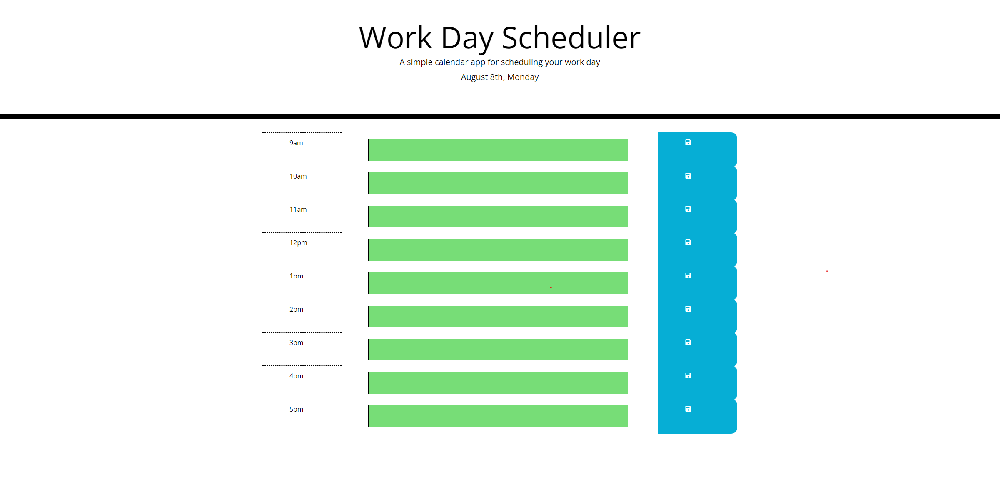

# Work-Day-Scheduler

This repository contains starter code that has been refracted to meet the given Acceptance criteria.

In the first commit, the original code is cloned into the repo.
The timeblocks are added to the HTML.
Additional changes are made to the css file.
The script.js file is created and added.

In the second commit, most changes are made to the javascript file and changes are made to the HTML and css files accordingly.

The third commit adds the screenshot of the application.

Here is the web application's appearance and functionality:

This is the link to the deployed application:
https://codejeffk.github.io/Work-Day-Scheduler/
